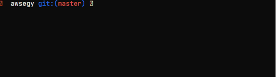

# awsegy

`awsegy` is interactive CLI tool.
From awsegy to aws infra to files to snapshots, everything is always at your fingertips

## Overview
`awsegy` is interactive CLI tool that is related AWS and Python boto3
It can select a ec2 server tags installed. 

### Option
* list
* change
* tag
* dtag

### Keep adding..
